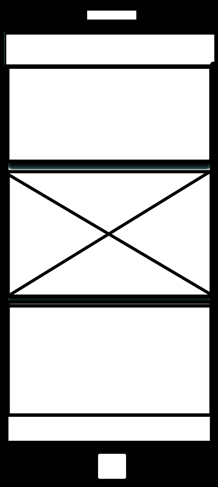

# PREVENT

This is my first project to showcase my skills in web development. 

The website is based on a project plan to build a website to inform users what 'Prevent' is. 
The initial Idea I had for the design, was 1950's american concept art. To give a jolly and charismatic feel to a chaotic topic; my sense of humor.

## Design & Planning

### User Stories
- As a visitor, I want to learn about PREVENT so I can understand community safeguarding
- As a user, I want to navigate easily between sections
- As a community member, I want to subscribe to updates

### Wireframes

### Typography
- Main font: System default fonts for readability and accessibility
- Headers: Bold weight for emphasis and clear hierarchy
- Body text: Standard weight for easy reading across all devices

### Colour Scheme
- Primary: Cadetblue (#5f9ea0) - Professional, trustworthy feel
- Secondary: RGB(216, 176, 127) - Warm, approachable background
- Accent: Black for text contrast and clear borders
- Theme: 1950's American vintage aesthetic

## Features
Features:
- Responsive navigation bar with smooth scrolling links
- Hero sections with overlay content boxes
- Newsletter subscription form with validation
- Bootstrap card components for content organization
- Sticky footer with copyright information
- Hidden rickroll easter egg for entertainment

### Navigation
- Fixed sticky navigation bar at top of page
- Smooth scrolling links to newsletter subscription section
- Responsive design that collapses on mobile devices
- Visual-only links for Jobs Board and Community Events (future features)

### Hero Sections
- Two distinct hero images (scouts, ghillie)
- Overlay content boxes with information about PREVENT
- Responsive background images that scale across devices

### Newsletter Subscription
- Interactive form with email validation
- JavaScript form handling and user feedback
- Responsive design that centers properly on all screen sizes

### Footer
- Sticky footer with copyright information
- Consistent styling with overall site theme

### Easter Egg
- Hidden rickroll feature for entertainment value
- Accessible via specific navigation path

## Technologies Used
- HTML5
- CSS3 (including CSS Grid and Flexbox)
- Bootstrap 5.3.7
- JavaScript (form validation)
- Font Awesome
- Responsive design principles

## Testing

### Manual Testing
| User Story | Test | Pass |
|------------|------|------|
| Learn about PREVENT | Navigate to homepage, read content sections | ✓ |
| Easy navigation | Click nav links, smooth scroll to sections | ✓ |
| Subscribe to newsletter | Fill form with valid email, submit successfully | ✓ |
| Responsive design | Test on mobile, tablet, desktop views | ✓ |

### Browser Compatibility
Tested on Chrome, Firefox, Safari, Edge - all working correctly

### Responsiveness
Responsive design tested from 320px mobile to 1200px+ desktop screens

### Code Validation
- HTML: Validated through W3C HTML Validator
- 

- CSS: Validated through W3C CSS Validator
- 

### Lighthouse

## Bugs
- Fixed horizontal scrolling issue by removing min-width: 480px from .main-container
- Resolved newsletter positioning on mobile by removing conflicting CSS positioning
- Fixed hero image responsiveness by changing from 100vw to 100% width

## Deployment

### Creating Repository on GitHub
Repository created using Code Institute template. Deployed using GitHub Pages.

### Deploying on Github Pages
1. Go to GitHub repository settings
2. Navigate to Pages section
3. Select 'main' branch as source
4. Site deployed successfully

## Credits

### Code & Content
- Bootstrap framework for responsive components
- CSS techniques learned from Code Institute curriculum
- JavaScript form validation methods

### Media
- Hero images: Custom military/scout themed imagery
- Icons: Font Awesome library
- Color scheme: Custom 1950's inspired palette

## Acknowledgments
Special thanks to Code Institute for the learning materials and project guidance.